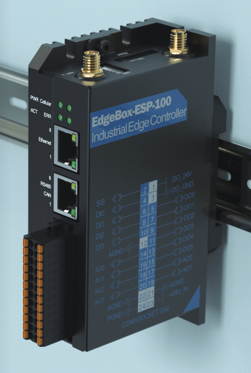

# EdgeBox-ESP-100

<a href="https://www.buymeacoffee.com/r4K2HIB" target="_blank"></a>


# Work in progress!!!

<p>Modbus server/MQTT publisher for the <a href=https://wiki.seeedstudio.com/Edgebox-ESP-100-Arduino/>Seeedstudio EdgeBox-ESP-100</a>.</p>
<p>Network: Wifi, Ethernet, 4G modem.</p>
<p>You must have a SIM with a static IP to be able to access the modbus server over the 4g network.</p>
<p align="left">
  
</p>


## License
```

 Copyright (c) 2025. ClassicDIY

  Unless required by applicable law or agreed to in writing, software
  distributed under the License is distributed on an "AS IS" BASIS,
  WITHOUT WARRANTIES OR CONDITIONS OF ANY KIND, either express or implied.
  See the License for the specific language governing permissions and
  limitations under the License.

```
